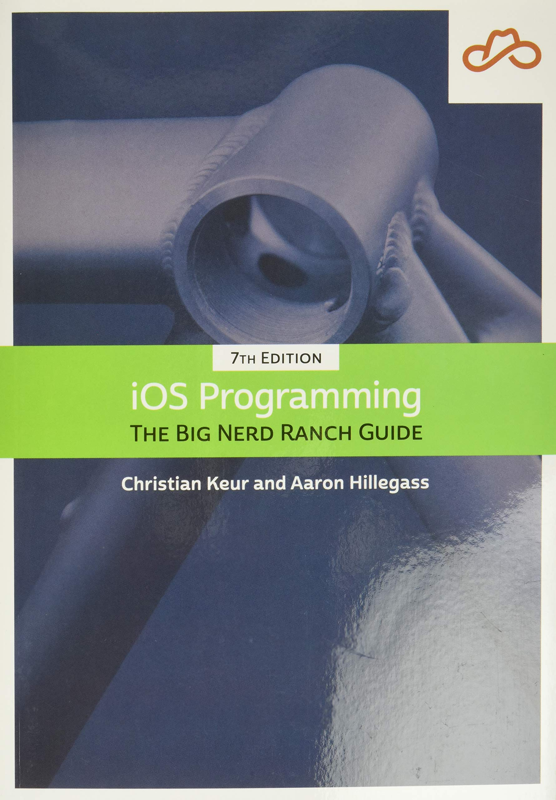

# iOS Programming - The Big Nerd Ranch Guide Tracker

Welcome to my repository for tracking my progress as I work through the 7th edition of "iOS Programming: The Big Nerd Ranch Guide." This repository serves as a place to keep a record of the chapters I've completed and the concepts I've learned along the way. As I journey through the book, I'll update this README to reflect my progress.

## Table of Contents

- [Introduction](#introduction)
- [Chapters](#chapters)
- [Progress](#progress)
- [Getting Started](#getting-started)
- [Contributing](#contributing)
- [License](#license)

## Introduction

"iOS Programming: The Big Nerd Ranch Guide" is a comprehensive resource for learning iOS app development using Swift. This repository documents my learning journey, chapter by chapter, as I dive into the world of iOS development.

## Chapters

1. **Introduction to Xcode and Interface Builder**
   In this chapter, I'll explore the basics of Xcode and Interface Builder, setting up my development environment and getting ready to build my first app.

2. **Swift Programming**
   This chapter delves into the Swift language, covering its syntax, data types, and control structures, laying the foundation for iOS development.

3. **Your First iOS Application**
   Time to put my Swift skills to use by creating a simple iOS application, understanding the MVC pattern, and building user interfaces.

4. **The Swift Type System**
   A deep dive into Swift's type system, generics, optionals, and error handling.

5. **Auto Layout**
   Learning how to create responsive user interfaces using Auto Layout and Size Classes.

6. **View Controllers**
   This chapter focuses on view controllers, navigation, and the Model-View-Controller architecture.

7. **Views and Animations**
   Exploring the world of custom views, animations, and gesture recognizers.

8. **Table Views**
   Mastering the art of table views, data source and delegate protocols, and custom table view cells.

9. **Stack Views**
   Understanding stack views for easy layout management and adapting to different screen sizes.

10. **Tab Bars and Collection Views**
    Creating tab bar interfaces and working with collection views for versatile content displays.

11. **Core Data: Your App's Back-End**
    Introducing Core Data for managing app data and persistent storage.

12. **Intermediate Swift**
    Going deeper into Swift language features and advanced techniques.

13. **Camera and Photos: Making Memories**
    Incorporating the device's camera and photo library into your app.

14. **UIKit and the Touch Subsystem**
    Gaining insights into how UIKit works with touch events and handling user interactions.

15. **Networking: Fetching Data from the Web**
    Connecting to web services, handling JSON data, and asynchronous networking.

16. **More About Auto Layout**
    Further exploration of Auto Layout with practical examples and advanced techniques.

17. **Web Services and UIWebView**
    Integrating web content into your app using UIWebView.

18. **Scrolling and Multithreading**
    Enhancing scrolling performance and managing concurrency in your app.

19. **Intermediate and Adaptive UI**
    Adapting your user interface for various devices and orientations.

20. **Animation and Drawing**
    Creating dynamic animations and custom graphics using Core Animation.

21. **OpenGL ES: Drawing with OpenGL**
    An introduction to OpenGL ES for advanced graphics and rendering.

22. **Core Animation Layers**
    In-depth look at Core Animation layers and advanced animation techniques.

23. **Touch Events and UIResponder**
    Understanding touch events and UIResponder for interactive app experiences.

24. **UINavigationController**
    Digging into UINavigationController for effective app navigation.

## Progress

Below is the list of chapters I've completed. As I finish each chapter, I'll mark it here.

- [x] Chapter 1 - Introduction to Xcode and Interface Builder
- [ ] Chapter 2 - Swift Programming
- [ ] Chapter 3 - Your First iOS Application
- [ ] Chapter 4 - The Swift Type System
- [ ] Chapter 5 - Auto Layout
- [ ] Chapter 6 - View Controllers
- [ ] Chapter 7 - Views and Animations
- [ ] Chapter 8 - Table Views
- [ ] Chapter 9 - Stack Views
- [ ] Chapter 10 - Tab Bars and Collection Views
- [ ] Chapter 11 - Core Data: Your App's Back-End
- [ ] Chapter 12 - Intermediate Swift
- [ ] Chapter 13 - Camera and Photos: Making Memories
- [ ] Chapter 14 - UIKit and the Touch Subsystem
- [ ] Chapter 15 - Networking: Fetching Data from the Web
- [ ] Chapter 16 - More About Auto Layout
- [ ] Chapter 17 - Web Services and UIWebView
- [ ] Chapter 18 - Scrolling and Multithreading
- [ ] Chapter 19 - Intermediate and Adaptive UI
- [ ] Chapter 20 - Animation and Drawing
- [ ] Chapter 21 - OpenGL ES: Drawing with OpenGL
- [ ] Chapter 22 - Core Animation Layers
- [ ] Chapter 23 - Touch Events and UIResponder
- [ ] Chapter 24 - UINavigationController

<!-- Update the list above as you complete more chapters -->

## Getting Started

To follow along with my progress or contribute to this repository:

1. Clone or fork the repository.
2. Navigate to the [Chapters](#chapters) section to find a brief description of each chapter.
3. Check the [Progress](#progress) section to see which chapters I've completed.
4. Feel free to open an issue or pull request if you have suggestions or want to share your insights.

## Contributing

If you're also going through the book or have suggestions to enhance my learning journey, I welcome your contributions! Feel free to open issues, provide feedback, or suggest improvements.

## License

This repository is licensed under the [MIT License](LICENSE). Feel free to use, modify, and share the content while providing attribution.

---

*Happy learning and coding!*
